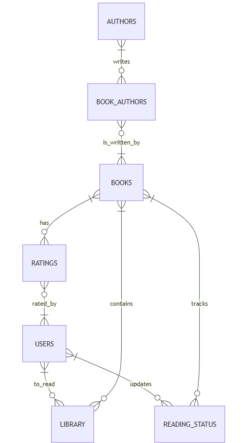

# Happy Reading Database

By Carolina Menegon

Video overview: <https://youtu.be/BRbrWXQx9lI>

## Scope

The `happy_reading` database was created to track books, authors, and allow users to manage their libraries, reading statuses, and book ratings. It includes all necessary entities to find books and their authors, as well as manage user libraries and ratings. The scope of the database includes:

* Authors, including personal details like name, birth date and nationality;
* Books, including key information such as title, description and publication details;
* Book Authors, including the relationship between books and authors;
* Users, including personal details like name, birth date, nationality, gender and username;
* Library, tracking books added by users and their reading statuses (to read or finished);
* Ratings, storing users' ratings for books;
* Reading Status, recording book actions (added, finished, deleted) within a user's library.

The database also includes triggers to track reading actions (adding, finishing, and deleting books) and to enforce data integrity in the `users` and `ratings` tables. Additionally, it includes views for summarizing finished books and calculating average ratings.

The database does not track book formats (e.g., hardcover, e-book), detailed publisher information, additional reading statuses (e.g., in-progress, abandoned), or extended user interactions like comments.

## Functional Requirements

This database will support:

* CRUD operations for core entities, including authors, books, users, library and ratings. Users are not able to modify other users' data;
* Establishing relationships between books and their respective authors;
* Users adding books to their libraries;
* Automatically tracking users' reading status (added, finished, deleted) via triggers on the library table;
* Rating books by users and tracking book ratings;
* Retrieving finished books and average book ratings through pre-defined database views.

The system enforces data integrity by preventing duplicate books in a user's library, ensuring ratings remain within a valid range, and requiring that books can only be rated if they have been added to the user's library and only once.

The system will not support book comments made by users. While authors are expected to be associated with books, they can exist in the database without one.

## Representation

"Entities are represented as MySQL tables in the following schema:

### Entities

The database includes the following entities:

#### Authors

The `authors` table includes:

* `id`, which specifies the unique identifier for the author as an `INT`, since `INT` is suitable for number ids. This column has the  `AUTO_INCREMENT` and `PRIMARY KEY` constraints applied. The `AUTO_INCREMENT` constraint ensures that a unique value is automatically assigned to each new record, and the `PRIMARY KEY` constraint ensures that each id is unique and `NOT NULL`;
* `name`, which specifies the author's full name as `VARCHAR (255)`, since `VARCHAR` is suitable for name fields and 255 characters are typically sufficient to store a full name. This column has the `NOT NULL` constraint applied, ensuring that this column is a required field;
* `birth_date`, which stores the author's birth date as `DATE`, since `DATE` is the appropriate data type for storing dates;
* `nationality`, which stores the author's nationality as `VARCHAR(50)`, since `VARCHAR` is suitable for text information and 50 characters are typically sufficient to store a nationality.

#### Books

The `books` table includes:

* `id`,  which specifies the unique identifier for each book as an `INT`, since `INT` is suitable for number ids. This column has the  `AUTO_INCREMENT` and `PRIMARY KEY` constraints applied, ensuring that each book has a unique and automatically generated identifier;
* `title`, which specifies the book title as `VARCHAR(255)`, since `VARCHAR` is suitable for text information and 255 characters are typically sufficient to store a book title. This column has the `NOT NULL` constraint applied, ensuring that this column is a required field;
* `book_description`, which stores a description about the book as `TEXT`, since `TEXT` is suitable for text information with multiple paragraphs;
* `pages`, which stores the number of pages a book has as an `INT`, since `INT` is suitable to store whole numbers;
* `publication_date`, which stores the date when the book was published as `DATE`, since `DATE` is the appropriate data type for storing dates. This column has the `NOT NULL` constraint applied, ensuring that this column is a required field;
* `publisher`, which stores the book publisher as `VARCHAR(50)`, since `VARCHAR` is suitable for text information and 50 characters are typically sufficient to store a publisher's name.

#### Book Authors

The `book_authors` table was created to avoid redundancy by managing the relationship between authors and books separately, rather than storing books directly in the `authors` table. The `book_authors` table includes:

* `id`,  which specifies the unique identifier for each author-book relationship as an `INT`, since `INT` is suitable for number ids. This column has the  `AUTO_INCREMENT` and `PRIMARY KEY` constraints applied, ensuring that each author-book relationship has a unique and automatically generated identifier;
* `author_id`, which stores the identifier for an author as an `INT`. This column has a `FOREIGN KEY` constraint that references the `id` column in the `authors` table, ensuring referential integrity;
* `book_id`, which stores the identifier for a book as an `INT`. This column has a `FOREIGN KEY` constraint that references the `id` column in the `books` table, ensuring referential integrity.

While authors and books are expected to be associated with each other, the system allows standalone entries to be included in the database.

#### Users

The `users` table includes:

* `id`,  which specifies the unique identifier for each user as an `INT`, since `INT` is suitable for number ids. This column has the  `AUTO_INCREMENT` and `PRIMARY KEY` constraints applied, ensuring that each user has a unique and automatically generated identifier;
* `name`, which specifies the user's full name as `VARCHAR (255)`, since `VARCHAR` is suitable for name fields and 255 characters are typically sufficient to store a full name. This column has the `NOT NULL` constraint applied, ensuring that this column is a required field;
* `birth_date`, which stores the user's birth date as `DATE`, since `DATE` is the appropriate data type for storing dates;
* `nationality`, which stores the user's nationality as `VARCHAR(50)`, since `VARCHAR` is suitable for text information and 50 characters are typically sufficient to store a nationality;
* `gender`, which stores the user's gender as `ENUM`, restricting values to predefined options. The list contains `other` and `prefer_not_to_say` to be more inclusive;
* `gender_custom`, which allows users to specify a custom gender if they have selected `other` in the `gender` column. It is stored as `VARCHAR(32)`, since `VARCHAR` is suitable for text information and 32 characters are typically sufficient for this purpose;
* `username`, which stores the user's chosen username as `VARCHAR(32)`, since `VARCHAR` is suitable for text information and 32 characters are typically sufficient to store a username. This column has the `UNIQUE` and `NOT NULL` constraints applied, ensuring that usernames are both distinct and required across all users.

Two triggers were created to enforce consistency in the `gender_custom` column: one ensures that users who select `other` in the `gender` column must provide a `gender_custom` value, while the other prevents users from entering a `gender_custom` if they select any other gender option.

#### Library

The `library` table includes:

* `id`,  which specifies the unique identifier for each book added to the library by a user as an `INT`, since `INT` is suitable for number ids. This column has the  `AUTO_INCREMENT` and `PRIMARY KEY` constraints applied, ensuring that each record in the library is uniquely and automatically generated;
* `user_id`, which stores the identifier for a user as an `INT`. This column has a `FOREIGN KEY` constraint that references the `id` column in the `users` table, ensuring referential integrity;
* `book_id`, which stores the identifier for a book as an `INT`. This column has a `FOREIGN KEY` constraint that references the `id` column in the `books` table, ensuring referential integrity;
* `finished`, which indicates whether a book has been marked as finished, stored as a `BOOLEAN`. Since `BOOLEAN` is suitable for true/false values, this column has a `DEFAULT 0`, meaning books are considered unfinished by default.

This table has a `UNIQUE` constraint on (`user_id`, `book_id`), preventing duplicate entries of the same book in a user's library. It also has three triggers that ensure when a book is added, deleted, or updated to finished, the corresponding action is recorded in the `reading_status`table.

#### Ratings

The `ratings` table includes:

* `id`,  which specifies the unique identifier for each rating as an `INT`, since `INT` is suitable for number ids. This column has the  `AUTO_INCREMENT` and `PRIMARY KEY` constraints applied, ensuring that each rating has a unique and automatically generated identifier;
* `book_id`, which stores the identifier for a book as an `INT`. This column has a `FOREIGN KEY` constraint that references the `id` column in the `books` table, ensuring referential integrity;
* `user_id`, which stores the identifier for a user as an `INT`. This column has a `FOREIGN KEY` constraint that references the `id` column in the `users` table, ensuring referential integrity;
* `rating`, which stores the rating attributed to a book by a user as a `DECIMAL(2,1)`. This choice is made to store ratings with one decimal place, ensuring precision. This column also has the `NOT NULL` constraint, ensuring that this is a required field.

This table applies a `CHECK` constraint to ensure that ratings are within the valid range of 0.0 to 5.0, inclusive. It also has a `UNIQUE` constraint, preventing duplicate ratings of the same book by the same user. Additionally, a trigger ensures that a book can only be rated by a user who has added it to their library.

#### Reading Status

The `reading_status` table includes:

* `id`,  which specifies the unique identifier for each reading status as an `INT`, since `INT` is suitable for number ids. This column has the  `AUTO_INCREMENT` and `PRIMARY KEY` constraints applied, ensuring that each reading status has a unique and automatically generated identifier;
* `user_id`, which stores the identifier for a user as an `INT`. This column has a `FOREIGN KEY` constraint that references the `id` column in the `users` table, ensuring referential integrity;
* `book_id`, which stores the identifier for a book as an `INT`. This column has a `FOREIGN KEY` constraint that references the `id` column in the `books` table, ensuring referential integrity;
* `action`, which stores the action taken by a user in their library as `ENUM`, restricting values to predefined options. The list contains `added`, `finished` and `deleted`;
* `timestamp`, which specifies when the action was made in the `library` table. It is stored as `TIMESTAMP`, type that is suitable to store date and time. The default value for the `timestamp` column is the current timestamp, as denoted by `DEFAULT CURRENT_TIMESTAMP`. This column also has the `NOT NULL` constraint, ensuring that this is a required field.

Data is added to this table through triggers when a book is added to, deleted from, or marked as finished in the `library` table.

### Relationships

The below entity relationship diagram describes the relationships among the entities in the database.

As detailed by the diagram:

* An author may be associated with 0 to many books, meaning they might not have any books in the database yet (0), but can also have one or more (many). Likewise, a book can be linked to 0 or many authors, allowing books to be added before assigning them to an author. This many-to-many relationship is managed by the `book_authors` table, which connects authors and books.
* The `library` table represents books added by users and their status (e.g., to read or finished). Each library record represents a specific user-book connection. The `library` table can contain 0 to many records. This means that there may be no records if no users have added any books to their libraries (0), or many records if one or more users add one or more books to their libraries (many). This many-to-many relationship is represented by the `library` table, which links users and books.
* The `ratings` table stores ratings of books given by users. Each rating record represents a specific user-book connection. The `ratings` table can contain 0 to many records. This means that there may be no records if no users have rated any books (0), or multiple records if one or more users rate one or more books (many). This many-to-many relationship is represented by the `ratings` table, which links users and books, adding a rating for each relation.
* The `reading_status` table tracks the status of books in a user's library (e.g., added, finished, deleted). Each record represents a specific user-book-status connection. The `reading_status` table can contain 0 to many records. This means there may not be any records if users have not added, finished, or deleted any books in their `library` table (0), or we can have one or multiple records if one or more users added, finished, or deleted one or more books in their `library` table (many). This many-to-many relationship is represented by the `reading_status` table, which links users and books, adding a status for each relation.

## Optimizations

Based on the common query patterns in `queries.sql`, indexes were strategically created to optimize database performance by improving query speed and efficiency. Since frequent lookups occur in the `book_authors`, `library`, and `ratings tables`, indexes were added to their foreign keys to speed up joins and searches. Additionally, as queries often filter or sort by `name` in the `authors` table, `title` in the `books` table, and `username` in the `users` table, indexes were created on these columns to speed up searches and improve access to relevant data.

Since it's common for users to look up usernames, book titles, and author names, as well as check the average rating of books, views were created to simplify queries and improve data visualization.

## Limitations

The current database design does not include specific tables for book genres or detailed publisher information. It also does not support multiple book formats (e.g., paperback, hardcover, e-book) or allow users to comment on book reviews. While the system lets users mark books as finished, it does not track other reading statuses (e.g., in progress, abandoned, rereading). Incorporating these features would require adding new tables, columns, or modifying existing table structures.
